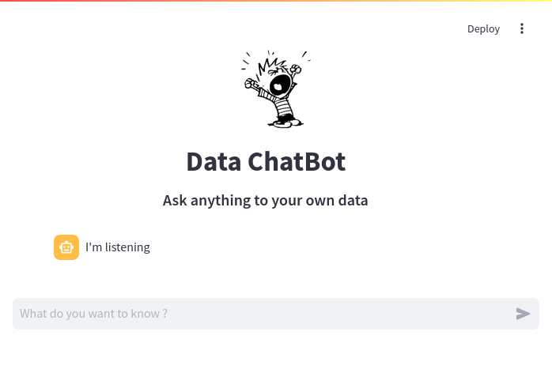

# Local Knowledge assistant

<!---->
<p align="center">
  
</p>

## Features

- Provides an easy way to deploy a chatbot for chatting with your own data
- Let you configure and/or translate UI messages and llm prompt

## Installation

```bash
git clone https://github.com/isingasimplesong/local-knowledge-assistant.git
cd local-knowledge-assistant
# put your data in data/
python3 -m venv venv
source venv/bin/activate
pip install -r requirements.txt
export GROQ_API_KEY=<YOUR_API_KEY>
streamlit run main.py
```

## Configuration

- Get a [groq API key here](https://console.groq.com/) to get the assistant running *as is*
- Or adjust the script and run it with OpenAI, a local llama model, or anything else
- you can change or translate the prompt sent to the model in `template.txt`,
- you can change or translate UI messages in `messages.json`,
- you can configure the Chatbot UI in `ui.json`

## Roadmap

- Provide a simpler way to change llm & embedding models
- Provide a simple way to update index
