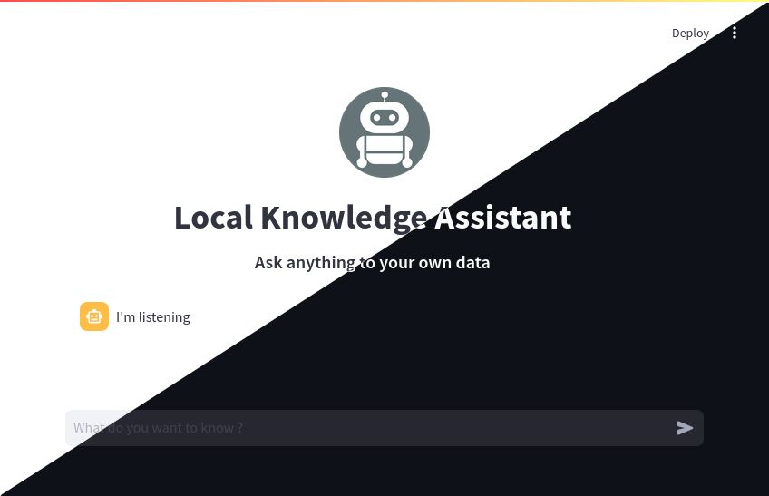

# LKA : Local Knowledge assistant

<p align="center">
  
</p>

## Features

- Provides an easy way to deploy a chatbot for chatting with your own data
- Choose from OpenAI API, Groq API, or your own Ollama
- Let you configure and/or translate UI messages and llm prompt

## Installation

### Linux

```bash
# clone code
git clone https://github.com/isingasimplesong/local-knowledge-assistant.git
cd local-knowledge-assistant
# put your data in data/
ln -s /path/to/your_data data
# create and activate a virtual env
python3 -m venv venv
source venv/bin/activate
# install dependencies
pip install -r requirements.txt
# edit config.yaml according to your needs
streamlit run main.py
```

### Mac

> [!warning]
> Untested. Please profide feedback if you try

You should be ok following linux instructions

### Windows

Use `powershell`

> [!warning]
> Untested. Please profide feedback if you try

```powershell
# clone code
git clone https://github.com/isingasimplesong/local-knowledge-assistant.git
cd local-knowledge-assistant
# Put your data in the data/ directory
# create and activate a virtual env
python -m venv venv
.\venv\Scripts\Activate  # Note: Use `deactivate` to exit the environment when done
# install dependencies
pip install -r requirements.txt
# edit config.yaml according to your needs
streamlit run main.py

```

## Configuration

- Get a [groq API key here](https://console.groq.com/) or an [OpenAI API key here](https://platform.openai.com/api-keys). If needed, [Ollama users should read this](https://github.com/ollama/ollama/issues/849)
- Edit `config.yaml` to your liking
- Set env variables `GROQ_API_KEY`and `OPENAI_API_KEY` [at system level](https://chatgpt.com/share/6715773a-ca24-800e-a80c-109fd28dce35)
- you can change or translate the prompt sent to the model in `template.txt`,
- you can change or translate UI messages in `messages.json`,
- you can configure the Chatbot UI in `ui.json`
- **The first run is expected to be slow :** The embedding model need to index
  all of your data

## Roadmap

- [x] ~Add conversation history to the context~
- [x] ~Provide a simpler way to change llm & embedding models~
- [x] ~Improve llm prompts~
- [x] ~add Anthropic to the available llms~
- [x] ~Auto reindexing when data change~
- [x] ~Recursive indexing~
- [ ] Provide a docker image for easy deployment

## Thanks

- to [Stéphane Debove](https://github.com/stephanedebove/gouroufabulus) for the initial code
- to [Gabriel Monette](https://github.com/GabrielMPhi/ParlerAuxArchives) for giving me the impulsion to do this
